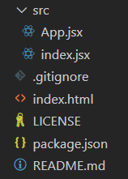

<p align="center">
  
</p>
<p align="center">
  🔍 A truly minimal replacement for Create-React-App.
</p>

<p align="center">
  
  
  
</p>

---

[Create-React-App](https://github.com/facebook/create-react-app) is way too bloated, use `nano-react-app` for a truly minimal React app.



Try now by running this in the terminal:

```
npx nano-react-app my-app
```

Take a look at the app template [here](https://github.com/adrianmcli/nano-react-app-template)

## Features

- Uses Parcel with **zero-config** instead of Webpack
- **No eject**, because it is already so minimal
- **No linting**
- **No service worker**
- `npm start` and `npm run build` scripts for dev server and production build

## Usage

For App configuration and usage info, see the template's [README](https://github.com/adrianmcli/nano-react-app-template/blob/master/README.md).
